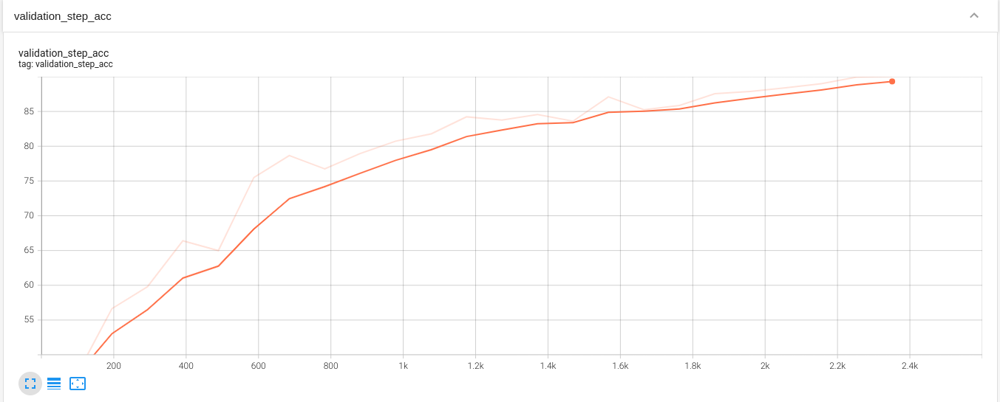

# S12 - CIFAR10 Data Set Classification Using Pytorch Lightning 
This is the repository for all the work done relating to ERA S12 assignment

## Description

The custom ResNet model and its training framework has been developed and trained using [Pytorch Lightning](https://lightning.ai).

An app has been developed to view the inferences made by this trained custom ResNet model. And it can be checked at the link [Hugging Face app](https://huggingface.co/spaces/HemaAM/Custom_ResNet)

## Code Structure

```bash
├───S12
│   ├───datasets
│   │   │   abstract_dataset.py
│   │   │   cifar10_dataset.py
│   │   │   __init__.py
│   │
│   ├───models
│   │   │   custom_Resnet.py
│   │   │   __init__.py
│   │
│   ├───utils
│   │       model_training.py
│   │       common.py
│   │       __init__.py
```

### 1. datasets Module
#### 1.1 datasets/generic.py Module
The datasets module contains **dataSet** class which creates train and test loaders and can visualise examples with labels.
It also performs basic transforms like Normalize and ToTensorV2.

This class has been developed to support as a base class for multiple datasets. Currently the class has been tested for CIFAR10 dataset. And this class can be extended to support MNIST dataset as well.

#### 1.2 datasets/cifar10_dataset.py Module
This module inherits the above abstract dataset module and applies normalizations and image augmentations specific to cifar10 datasets.
Image Normalization is done using the following factors

```python

    mean = (0.49139968, 0.48215827, 0.44653124)
    std = (0.24703233, 0.24348505, 0.26158768)
```

Image Augmentations used as as follows:

```python
import albumentations as A


    A.ColorJitter(brightness=0, contrast=0.1, 
                  saturation=0.2, hue=0.1, p=0.5),
    A.ToGray(p=0.2),
    A.PadIfNeeded(40, 40, p=1),
    A.RandomCrop(32, 32, p=1),

    A.HorizontalFlip(p=0.5),
    A.CoarseDropout(max_holes=1, 
                    max_height=8, 
                    max_width=8, p=1, 
                    fill_value=0),

```
Sample images used for training after applying the above transformations are as follows


### 2. models Module
This module contains custom resnet model using Pytorch Lightning. Following is the model summary as given by the Lightning Model Summary callback 

```
INFO:pytorch_lightning.callbacks.model_summary:
   | Name                                       | Type             | Params
---------------------------------------------------------------------------------
0  | criterion                                  | CrossEntropyLoss | 0     
1  | train_accuracy                             | model_accuracy   | 0     
2  | validation_accuracy                        | model_accuracy   | 0     
3  | train_loss                                 | MeanMetric       | 0     
4  | validation_loss                            | MeanMetric       | 0     
5  | prep_block                                 | custBlock        | 1.9 K 
6  | prep_block.conv_pool_block                 | convLayer        | 1.9 K 
7  | prep_block.conv_pool_block.convLayer       | Conv2d           | 1.7 K 
8  | prep_block.conv_pool_block.normLayer       | BatchNorm2d      | 128   
9  | prep_block.conv_pool_block.activationLayer | ReLU             | 0     
10 | block1                                     | custBlock        | 369 K 
11 | block1.conv_pool_block                     | convLayer        | 74.0 K
12 | block1.conv_pool_block.convLayer           | Conv2d           | 73.7 K
13 | block1.conv_pool_block.max_pooling         | MaxPool2d        | 0     
14 | block1.conv_pool_block.normLayer           | BatchNorm2d      | 256   
15 | block1.conv_pool_block.activationLayer     | ReLU             | 0     
16 | block1.residual_block                      | Sequential       | 295 K 
17 | block1.residual_block.0                    | convLayer        | 147 K 
18 | block1.residual_block.0.convLayer          | Conv2d           | 147 K 
19 | block1.residual_block.0.normLayer          | BatchNorm2d      | 256   
20 | block1.residual_block.0.activationLayer    | ReLU             | 0     
21 | block1.residual_block.1                    | convLayer        | 147 K 
22 | block1.residual_block.1.convLayer          | Conv2d           | 147 K 
23 | block1.residual_block.1.normLayer          | BatchNorm2d      | 256   
24 | block1.residual_block.1.activationLayer    | ReLU             | 0     
25 | block2                                     | custBlock        | 295 K 
26 | block2.conv_pool_block                     | convLayer        | 295 K 
27 | block2.conv_pool_block.convLayer           | Conv2d           | 294 K 
28 | block2.conv_pool_block.max_pooling         | MaxPool2d        | 0     
29 | block2.conv_pool_block.normLayer           | BatchNorm2d      | 512   
30 | block2.conv_pool_block.activationLayer     | ReLU             | 0     
31 | block3                                     | custBlock        | 5.9 M 
32 | block3.conv_pool_block                     | convLayer        | 1.2 M 
33 | block3.conv_pool_block.convLayer           | Conv2d           | 1.2 M 
34 | block3.conv_pool_block.max_pooling         | MaxPool2d        | 0     
35 | block3.conv_pool_block.normLayer           | BatchNorm2d      | 1.0 K 
36 | block3.conv_pool_block.activationLayer     | ReLU             | 0     
37 | block3.residual_block                      | Sequential       | 4.7 M 
38 | block3.residual_block.0                    | convLayer        | 2.4 M 
39 | block3.residual_block.0.convLayer          | Conv2d           | 2.4 M 
40 | block3.residual_block.0.normLayer          | BatchNorm2d      | 1.0 K 
41 | block3.residual_block.0.activationLayer    | ReLU             | 0     
42 | block3.residual_block.1                    | convLayer        | 2.4 M 
43 | block3.residual_block.1.convLayer          | Conv2d           | 2.4 M 
44 | block3.residual_block.1.normLayer          | BatchNorm2d      | 1.0 K 
45 | block3.residual_block.1.activationLayer    | ReLU             | 0     
46 | max_pool_layer                             | MaxPool2d        | 0     
47 | flatten_layer                              | Flatten          | 0     
48 | fc                                         | Linear           | 5.1 K 
---------------------------------------------------------------------------------
6.6 M     Trainable params
0         Non-trainable params
6.6 M     Total params
26.293    Total estimated model params size (MB)

```

### 3. utils Module
#### 3.1 utils/model_training.py
This module defines a class which can be used to train the model, and which carries out training and testing.
Apart from this it also does the following:
1. Uses ADAM Optimizer with One Cycle LR. It uses LR Finder to get the steepest LR. The LR finder curve can be found below.
2. Performs train-test iterations for a given number of epochs or a given validation target accuracy.
3. Show Misclassified examples
4. Create GradCAM visualisations of misclassified examples
5. Has functionality to save the misclassified examples to files in the folder 'misclassified_examples'
6. Has functionality to save the trained model to 'cust_resnet_model_saved.pth' file 


#### 3.2 utils/common.py
This module contains following helper functions/classes:
1. Set random seed
2. Check for GPU device
3. Set batch size
4. Plot dataset images
5. Define custom metric class which contains methods to accumulate the accuracies for each epoch
6. Compute for GradCAM visualizations
7. Extract incorrect predictions

## 4. Results

Best Train Accuracy: 86.66%

Best Test Accuracy: 90.52%

Validation Accuracy:


Validation Loss:
 

Misclassified Images:


Misclassified images with GradCAM:


## Usage

To run the project, open the S12.ipynb in github and click on the "Open in Colab" icon in the ipynb file to open the file in Google Colab and start executing the cells of the notebook. The installation of the required dependencies is taken care by executing the following cell of the notebook. 
```
!pip install -r requirements.txt
```
We can execute the `S12.ipynb` notebook to perform the training and testing. Adjust the parameters such as dropout, number of epochs to improve the model performance as desired.

Please note that this README serves as a placeholder. As I make further modifications to the project, I would keep this file updated accordingly. 
